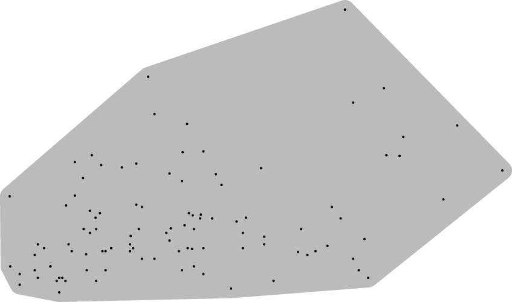

austin-survey
=============

###I wanted to know what the most highly recommended places to eat/drink in Austin were

By compiling the ranks from Yelp, Zagat, TripAdvisor, and Foursquare I came up with a rank ordering, but I wansn't completly convinced. So I asked the Internet for their opinion

##I asked the Austin subreddit to take a survey
[...and the response was overwhelming](http://www.reddit.com/r/Austin/comments/2m16a3/hey_austin_my_analysis_of_yelp_zagat_tripadvisor/)

761 people took this survey:

[Survey - Part 1](https://docs.google.com/forms/d/1-RL1IUfHQReRdZzscSKRWN4qFee3hio--wrLj7_njIs/viewform)

and 216 continued on to the next section:

[Survey - Part 2](https://docs.google.com/forms/d/1JoAbYZWyvsISxrj_iiCchAf1XnQuxuLhF2eGyi0lT9g/viewform)

(761 * 34) + (216 * 69) = 40,778 radio boxes clicked.

Wow.

#Results
For the analysis I simply sorted by percent of respondents who replied  "Yes" to the question "I would recommend this place to a friend?" 

##Austin's Top-10 Recommended Places:
1. Torchy's Tacos
1. Whole Foods
1. Home Slice Pizza
1. Hopdoddy Burger Bar
1. Tacodeli
1. Magnolia Cafe
1. Rudy's Country Store & Bar-B-Q
1. Easy Tiger
1. Franklin BBQ
1. Draught House Pub & Brewery

###To-Do: Compile all the write-in recommendations

#[Link to Google Sheet](https://docs.google.com/spreadsheets/d/1_8lvdjW8bTWL6McC1g0PdUq_1Q2tS57l3Bfgm44rHXU/edit?usp=sharing)

#Excel spreadsheet and CSVs of each sheet are also in the repository (above)

#Chart showing convex hull thingy
[Chart made with RAW - go play!](http://app.raw.densitydesign.org/)

